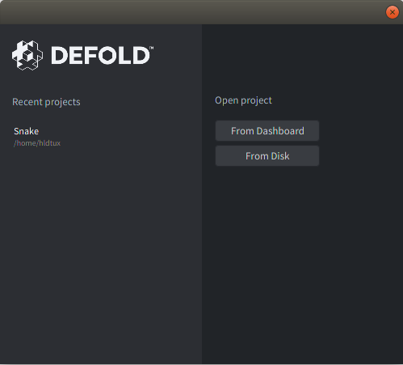
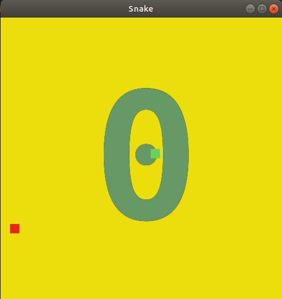

# Snake Game

Snake game created with Defold engine created by King.com


# Dependencies

1. [Defold](https://www.defold.com/editor-two)

# How to run

```
git clone https://github.com/humbertodias/game-snake-defold
```

# Open the project

Click on **From disk** and select the file **game.project**




# Output

Project > Build




# References

[Snake in 35min programmieren](https://www.youtube.com/watch?v=MZ8hpr9xKHA)

[Defold Engine](https://www.defold.com/editor-two)